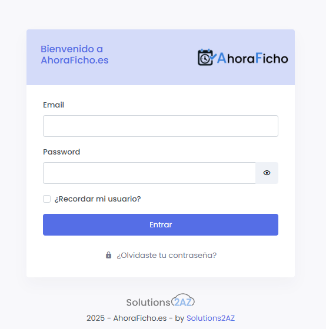

# Acceso a la Plataforma
{: .no_toc }

Cómo acceder a AhoraFicho desde diferentes dispositivos y qué hacer si olvidas tu contraseña.
{: .fs-6 .fw-300 }

---

## Contenido
{: .no_toc .text-delta }

1. TOC
{:toc}

---

## URLs de acceso

AhoraFicho está disponible en múltiples plataformas:

### 🌐 Acceso Web

Accede desde cualquier navegador moderno:

**URL principal**: [https://www.ahoraficho.es](https://www.ahoraficho.es)

{: .note }
> La plataforma es **multi-tenant**, lo que significa que tu empresa tiene su propio espacio aislado dentro de AhoraFicho.

#### Navegadores compatibles

| Navegador | Versión mínima | Estado |
|:----------|:--------------|:-------|
| Google Chrome | 90+ | ✅ Recomendado |
| Mozilla Firefox | 88+ | ✅ Recomendado |
| Microsoft Edge | 90+ | ✅ Recomendado |
| Safari | 14+ | ✅ Compatible |
| Opera | 76+ | ✅ Compatible |

### 📱 Aplicaciones móviles

Las apps móviles son **webviews embebidas** de la plataforma web, optimizadas para móvil.

- **Android**: [Descargar desde Google Play](https://play.google.com/store/apps/details?id=net.solutions2az.ahoraficho)
- **iOS**: Próximamente en App Store

{: .tip }
> Las aplicaciones móviles ofrecen una experiencia optimizada y permiten recibir notificaciones push.

---

## Primer acceso

### Credenciales iniciales

Después del onboarding, recibirás un email con:

- **Usuario**: Tu email corporativo
- **Contraseña temporal**: Generada automáticamente

### Paso 1: Acceder a la plataforma

1. Abre tu navegador y ve a [https://www.ahoraficho.es](https://www.ahoraficho.es)
2. Haz clic en **"Entrar"** o **"Login"**
3. Introduce tu email y contraseña temporal


*Pantalla de inicio de sesión de AhoraFicho*

### Paso 2: Cambiar contraseña temporal

{: .warning }
> **Obligatorio**: Por seguridad, debes cambiar tu contraseña temporal en el primer acceso.

1. Una vez dentro, ve a **"Mi Perfil"** (icono de usuario arriba a la derecha)
2. Selecciona **"Cambiar contraseña"**
3. Introduce:
   - Contraseña actual (la temporal)
   - Nueva contraseña
   - Confirmar nueva contraseña

**Requisitos de la contraseña:**
- Mínimo 8 caracteres
- Al menos una mayúscula
- Al menos un número
- Al menos un carácter especial (@, #, $, %, etc.)

---

## Interfaz de usuario

### Dashboard principal

Al iniciar sesión, verás el **Dashboard** con información relevante según tu rol:

#### Para empleados
- Estado actual (fichado / no fichado)
- Botón de fichaje visible
- Resumen de ausencias pendientes
- Documentos por leer

#### Para managers
- Todo lo anterior +
- Validaciones pendientes del equipo
- Resumen del estado del equipo

#### Para administradores
- Todo lo anterior +
- Resumen general de la empresa
- Usuarios activos
- Alertas del sistema

### Menú lateral

El menú lateral se organiza en secciones según tu rol. Consulta la sección [Estructura del menú](#estructura-del-menu) más abajo.

---

## Estructura del menú

El menú lateral muestra diferentes opciones según tu rol:

### 👤 Empleado (sin rol adicional)

```
📊 Dashboard
👤 Mi Trabajo
   ├── Mis Fichajes
   ├── Mi resumen diario
   ├── Mis ausencias
   └── [otros módulos activos]
👥 Equipo
   ├── Calendario del equipo
   └── [otros calendarios]
```

### 👨‍💼 Manager

```
[Todo lo anterior] +
✅ Validaciones
   ├── Cambios de Fichajes
   ├── Ausencias Pendientes
   ├── Gastos Pendientes
   └── Imputaciones Pendientes
📈 Reportes
   ├── Resumen Diario Dpto.
   ├── Resumen Semanal Dpto.
   └── [otros reportes]
🏢 Empresa
   └── [vistas de empresa]
```

### 🔧 Administrador

```
[Todo lo anterior] +
⚙️ Configuraciones
   ├── Trabajadores
   ├── Departamentos
   ├── Edificios
   ├── Horarios
   ├── Días festivos
   └── [más configuraciones]
```

{: .note }
> Solo verás los módulos que estén **activados** en tu empresa.

---

## Acceso desde móvil

### Instalación de la app

Consulta la guía [Descarga App Móvil](/primeros-pasos/descarga-app-movil/) para instrucciones detalladas.

### Acceso mediante QR

La forma más rápida de acceder desde la app móvil es mediante código QR:

1. Instala la app desde Google Play
2. Abre la app
3. Pulsa **"Acceder a mi panel"**
4. Selecciona **"Escanear código QR"**
5. En la web, ve a tu perfil y genera el código QR
6. Escanea el código con la app

{: .tip }
> El código QR te permite acceder sin introducir usuario y contraseña manualmente.

### Acceso manual en la app

Si prefieres acceder manualmente:

1. Abre la app
2. Pulsa **"Acceder a mi panel"**
3. Selecciona **"Introducir manualmente"**
4. Introduce tu email y contraseña

---

## Recuperación de contraseña

### ¿Olvidaste tu contraseña?

1. En la pantalla de login, haz clic en **"¿Olvidaste tu contraseña?"**
2. Introduce tu email corporativo
3. Recibirás un email con un enlace de recuperación
4. Haz clic en el enlace (válido por 24 horas)
5. Establece tu nueva contraseña

{: .warning }
> Si no recibes el email en 5 minutos, revisa tu carpeta de spam o contacta con tu administrador.

### No recuerdo mi usuario

Tu usuario **siempre es tu email corporativo**. Si no lo recuerdas:

- Pregunta a tu administrador de sistemas
- Contacta con soporte: soporte@ahoraficho.es

---

## Cerrar sesión

Para cerrar sesión de forma segura:

1. Haz clic en tu nombre/avatar (arriba a la derecha)
2. Selecciona **"Desconectarse"** o **"Cerrar sesión"**

{: .important }
> **Buena práctica**: Cierra siempre tu sesión si usas un ordenador compartido.

---

## Mantener sesión activa

Por defecto, AhoraFicho mantiene tu sesión activa durante:
- **Web**: 8 horas de inactividad
- **App móvil**: 30 días

Puedes marcar **"Recordar mi usuario"** en el login para facilitar futuros accesos.

---

## Problemas comunes

### No puedo iniciar sesión

**Posibles causas y soluciones:**

| Problema | Solución |
|:---------|:---------|
| Usuario o contraseña incorrectos | Verifica que introduces correctamente el email y contraseña. Usa "Recuperar contraseña" si es necesario |
| Cuenta desactivada | Contacta con tu administrador - tu cuenta puede estar temporalmente desactivada |
| Problemas de red | Verifica tu conexión a internet |
| Navegador no compatible | Actualiza tu navegador o usa uno compatible |

### La página no carga correctamente

1. Limpia la caché del navegador (Ctrl + F5)
2. Prueba en modo incógnito/privado
3. Prueba con otro navegador
4. Contacta con soporte si persiste

### No veo todas las opciones del menú

Esto es normal. El menú muestra solo las opciones disponibles según:
- Tu rol (Empleado, Manager, Admin, SuperAdmin)
- Los módulos activados en tu empresa

Si crees que deberías ver más opciones, contacta con tu administrador.

---

## Seguridad y privacidad

### Buenas prácticas

- 🔐 No compartas tu contraseña con nadie
- 🔄 Cambia tu contraseña periódicamente
- 🚪 Cierra sesión en equipos compartidos
- 📱 Protege tu dispositivo móvil con PIN/huella

### Política de privacidad

AhoraFicho cumple con el RGPD (Reglamento General de Protección de Datos). Tus datos están:
- 🔒 Cifrados en tránsito y en reposo
- 🏢 Alojados en servidores seguros en la UE
- 🛡️ Protegidos contra accesos no autorizados

---

## Próximos pasos

Ahora que ya sabes cómo acceder a la plataforma:

1. 👉 [Realiza tu primer fichaje](/primeros-pasos/primer-fichaje/)
2. 👉 [Descarga la app móvil](/primeros-pasos/descarga-app-movil/)
3. 👉 [Configura tu perfil](/guias-por-rol/empleado/mi-perfil/)

---

## ¿Necesitas ayuda?

Si tienes problemas para acceder a la plataforma:

- 📧 Email: soporte@ahoraficho.es
- 💬 Consulta las [Preguntas Frecuentes](/preguntas-frecuentes/)
- 👨‍💼 Contacta con tu administrador interno
