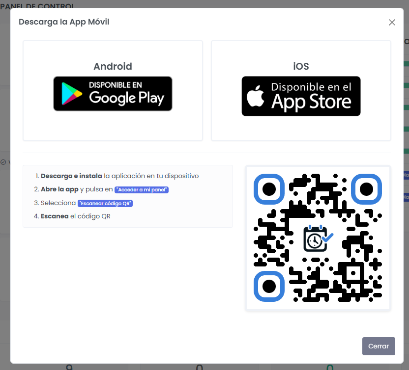

# Descarga la App Móvil
{: .no_toc }

Cómo instalar y configurar la aplicación de AhoraFicho en tu dispositivo iOS o Android.
{: .fs-6 .fw-300 }

---

## Contenido
{: .no_toc .text-delta }

1. TOC
{:toc}

---

## Sobre las aplicaciones móviles

Las aplicaciones de AhoraFicho para iOS y Android son **webviews embebidas**, lo que significa que:

- ✅ Cargan la misma plataforma web optimizada para móvil
- ✅ Siempre están actualizadas (no requieren actualizaciones constantes)
- ✅ Ofrecen experiencia nativa (notificaciones push, acceso rápido)

{: .important }
> **Conexión a internet obligatoria**: La app requiere conexión a internet (WiFi o datos móviles) para funcionar. No dispone de modo offline: ni el fichaje ni las consultas funcionan sin conexión.

---

## Disponibilidad

| Plataforma | Estado | Enlace |
|:-----------|:-------|:-------|
| **Android** | ✅ Disponible | [Google Play Store](https://play.google.com/store/apps/details?id=net.solutions2az.ahoraficho) |
| **iOS** | ✅ Disponible | [App Store](https://apps.apple.com/es/app/ahoraficho/id6757076575) |

---

## Instalación en Android / iOS

### Opción 1: Desde Google Play Store (Recomendada)

1. Abre **Google Play Store** en tu dispositivo
2. Busca **"AhoraFicho"**
3. Selecciona la app desarrollada por **Solutions2AZ**
4. Pulsa **"Instalar"**
5. Espera a que se complete la descarga e instalación
6. Pulsa **"Abrir"**

**Enlace directo:**
[https://play.google.com/store/apps/details?id=net.solutions2az.ahoraficho](https://play.google.com/store/apps/details?id=net.solutions2az.ahoraficho)

### Opción 2: Desde App Store (Recomendada)

1. Abre **App Store** en tu dispositivo
2. Busca **"AhoraFicho"**
3. Selecciona la app desarrollada por **Solutions2AZ**
4. Pulsa **"Instalar"**
5. Espera a que se complete la descarga e instalación
6. Pulsa **"Abrir"**

**Enlace directo:**
[https://apps.apple.com/es/app/ahoraficho/id6757076575](https://apps.apple.com/es/app/ahoraficho/id6757076575)

### Opción 3: Desde el modal de la web

1. Accede a AhoraFicho desde tu navegador móvil
2. En el menú lateral, pulsa **"Descargar APP"** (al final del menú)
3. Se abrirá un modal con:
   - Enlace directo a Google Play o App Store
   - Código QR para escanear
   - Instrucciones de acceso
4. Pulsa **"Icono de cada plataforma"**

*Modal de descarga de app desde la web*

---

## Primer acceso a la app

Una vez instalada la aplicación, tienes **dos formas** de acceder:

### Opción 1: Escanear código QR (Más rápida)

Esta es la forma más sencilla y rápida:

1. **En la web** (desde un ordenador):
   - Accede a tu cuenta en AhoraFicho.es
   - Ve al menú lateral
   - Pulsa en **"Descargar APP"** (al final del menú)
   - Se abrirá un modal con un **código QR**

2. **En la app móvil**:
   - Abre la aplicación
   - Pulsa **"Acceder a mi panel"**
   - Selecciona **"Escanear código QR"**
   - Apunta la cámara al código QR mostrado en la web
   - Entra con tu email/usuario y contraseña

### Opción 2: Introducir credenciales manualmente

Si prefieres acceder manualmente:

1. Abre la aplicación
2. Pulsa **"Acceder a mi panel"**
3. Selecciona **"Introducir manualmente"**
4. Introduce:
   - **Url**: Url de tu entorno
5. Pulsa **"Entrar"**

---

## Configuración inicial

### Permisos necesarios

La app solicitará permisos para funcionar correctamente:

#### 📍 Ubicación (GPS)
- **Cuándo**: Al fichar
- **Por qué**: Para registrar tu ubicación si está habilitada
- **Opciones**:
  - "Permitir siempre" - Recomendado para trabajadores de campo
  - "Permitir solo mientras se usa la app" - Suficiente para uso en oficina

#### 📷 Cámara
- **Cuándo**: Al escanear el código QR de configuración de la app
- **Por qué**: Para leer el código QR que se muestra en la web al pulsar **"Descargar APP"**
- **Necesario solo para el primer acceso mediante QR**

#### 🔔 Notificaciones
- **Cuándo**: Primera apertura
- **Por qué**: Para recibir recordatorios y alertas
- **Recomendado**: Activar para no perder notificaciones importantes

### Configurar permisos en Android

Si rechazaste algún permiso por error, puedes activarlo después:

1. Ve a **Ajustes** de Android
2. Selecciona **Aplicaciones** o **Apps**
3. Busca **AhoraFicho**
4. Toca en **Permisos**
5. Activa los permisos necesarios:
   - ✅ Ubicación
   - ✅ Cámara (si usas QR)
   - ✅ Notificaciones

---

## Usar la aplicación

### Pantalla principal

Al abrir la app verás:

- **Estado actual**: Si estás fichado o no
- **Botón de fichaje prominente**: Para fichar con un solo toque
- **Menú inferior**: Acceso rápido a secciones principales
- **Menú hamburguesa**: Acceso completo a todas las funcionalidades

### Navegación rápida

La app tiene un menú inferior con acceso directo a:

- 🏠 **Inicio / Dashboard**
- 👤 **Mi Trabajo** (Fichajes, ausencias, etc.)
- 👥 **Equipo** (si eres manager)
- ⚙️ **Perfil y configuración**

### Fichar desde la app

1. Abre la aplicación
2. En la pantalla principal verás el **botón de fichaje**
3. El botón cambia automáticamente según tu estado:
   - *"Iniciar jornada"* - Si no has fichado
   - *"Iniciar pausa"* - Si estás trabajando
   - *"Terminar pausa"* - Si estás en pausa
   - *"Finalizar jornada"* - Para terminar tu día
4. **Pulsa el botón**
5. Si está configurado, permitirá el acceso a ubicación
6. ¡Fichaje registrado!

{: .note }
> El fichaje desde la app se registra al instante en la plataforma web. Recuerda que necesitas conexión a internet para poder fichar.

---

## Notificaciones push

La app puede enviarte notificaciones para:

- ⏰ Recordatorios de entrada y salida
- ⚠️ Alertas de fichaje incompleto o de llegada tarde
- ✅ Cambios de estado en tus solicitudes (ausencias, cambios de fichaje)
- 📄 Nuevos documentos recibidos

Puedes configurar qué notificaciones recibes y por qué canal (email o push) desde **"Mi Perfil"** → **"Notificaciones"**.

👉 [Ver guía: Notificaciones](/guias-por-rol/empleado/notificaciones/)

---

## Problemas comunes

### La app no se instala

**Posibles causas:**
- Espacio insuficiente en el dispositivo
- Versión de Android no compatible (mínimo: Android 7.0)
- Problemas con Google Play Store

**Soluciones:**
1. Libera espacio en tu dispositivo
2. Verifica que tu Android esté actualizado
3. Limpia caché de Google Play Store
4. Reinicia el dispositivo

### No puedo escanear el código QR

**Posibles causas:**
- Permisos de cámara no concedidos
- Código QR mal iluminado o borroso

**Soluciones:**
1. Verifica permisos de cámara en Ajustes
2. Mejora la iluminación
3. Acerca/aleja la cámara del código
4. Si persiste, usa la opción de acceso manual

### La app no carga / pantalla en blanco

**Posibles causas:**
- Sin conexión a internet
- Caché corrupta de la app

**Soluciones:**
1. Verifica tu conexión a internet
2. Fuerza el cierre de la app:
   - Ajustes → Apps → AhoraFicho → Forzar detención
3. Limpia caché:
   - Ajustes → Apps → AhoraFicho → Almacenamiento → Limpiar caché
4. Si persiste, desinstala y reinstala la app

### La ubicación no se registra

**Soluciones:**
1. Verifica que el GPS esté activado en tu dispositivo
2. Concede permisos de ubicación:
   - Ajustes → Apps → AhoraFicho → Permisos → Ubicación → "Permitir siempre"
3. Verifica que estés en exteriores (el GPS funciona mejor fuera)
4. Reinicia el dispositivo

---

## Actualizar la aplicación

### Actualizaciones automáticas

Si tienes activadas las actualizaciones automáticas en Google Play:
- La app se actualizará sola cuando haya nuevas versiones
- No perderás tus datos ni tendrás que volver a iniciar sesión

### Actualización manual

1. Abre **Google Play Store** o **App Store**
2. Busca **AhoraFicho**
3. Si hay actualización disponible, verás el botón **"Actualizar"**
4. Pulsa **"Actualizar"**

{: .tip }
> Te recomendamos mantener siempre la última versión para tener las últimas mejoras y correcciones.

---

## Desinstalar la aplicación

Si necesitas desinstalar la app:

1. Mantén pulsado el icono de AhoraFicho en tu pantalla de inicio
2. Arrastra a **"Desinstalar"** o pulsa la opción que aparece
3. Confirma la desinstalación

**O desde ajustes:**

1. Ve a **Ajustes** → **Aplicaciones**
2. Busca **AhoraFicho**
3. Pulsa **"Desinstalar"**

{: .warning }
> Al desinstalar la app perderás la sesión y la configuración guardada en el dispositivo (permisos, preferencias), pero tu información en la plataforma web permanece intacta.

---

## Alternativa: Acceso desde navegador móvil

Si prefieres no instalar la app, puedes acceder desde cualquier navegador móvil:

1. Abre **Chrome**, **Firefox** o **Safari** en tu móvil
2. Ve a [https://demo.ahoraficho.es](https://demo.ahoraficho.es)
3. Inicia sesión normalmente
4. La web está **optimizada para móvil** y funciona perfectamente

### Añadir a pantalla de inicio (PWA)

Puedes añadir AhoraFicho a tu pantalla de inicio sin instalar la app:

**En Chrome (Android):**
1. Accede a demo.ahoraficho.es
2. Pulsa el menú (⋮) → **"Añadir a pantalla de inicio"**
3. Dale un nombre y pulsa **"Añadir"**
4. Ahora tendrás un icono de acceso directo en tu pantalla de inicio

**En Chrome (iOS):**
1. Accede a demo.ahoraficho.es
2. Pulsa el menú (⋮) → Compartir → **"Añadir a pantalla de inicio"**
3. Dale un nombre y pulsa **"Añadir"**
4. Ahora tendrás un icono de acceso directo en tu pantalla de inicio
---

## Próximos pasos

Ahora que tienes la app instalada:

1. 👉 [Realiza tu primer fichaje desde la app](/primeros-pasos/primer-fichaje/)
2. 👉 [Consulta tus fichajes](/guias-por-rol/empleado/consultar-mis-fichajes/)
3. 👉 [Aprende a solicitar vacaciones](/guias-por-rol/empleado/solicitar-vacaciones/)

---

## ¿Necesitas ayuda?

Si tienes problemas con la aplicación móvil:

- 📧 Email: soporte@ahoraficho.es
- 💬 Consulta las [Preguntas Frecuentes](/preguntas-frecuentes/)
- 🤖 Reporta bugs a través de soporte técnico
