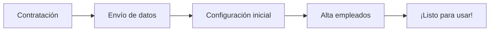

# Primeros Pasos con AhoraFicho
{: .no_toc }

Esta sección te guiará paso a paso en tus primeros momentos con AhoraFicho, desde el registro inicial hasta tu primer fichaje.
{: .fs-6 .fw-300 }

---

## Contenido
{: .no_toc .text-delta }

1. TOC
{:toc}

---

## ¿Qué aprenderás en esta sección?

En esta guía de inicio rápido, aprenderás todo lo necesario para empezar a usar AhoraFicho:

### Para nuevos usuarios

- ✅ Cómo acceder a la plataforma por primera vez
- ✅ Navegar por el menú y las secciones principales
- ✅ Realizar tu primer fichaje
- ✅ Descargar e instalar la app móvil

### Para administradores

- ✅ Proceso de onboarding y configuración inicial
- ✅ Configuración básica de la empresa
- ✅ Dar de alta a los primeros empleados
- ✅ Activar módulos necesarios

---

## Proceso de onboarding

Cuando contratas AhoraFicho, el proceso es el siguiente:

{: .highlight }
Solutions2AZ se encarga de la configuración inicial de tu plataforma, aunque posteriormente puedes modificar todos los parámetros.

---

## Guías en esta sección

### 1. [Registro y Onboarding](/primeros-pasos/registro-y-onboarding/)
Proceso de alta de la empresa y configuración inicial realizada por Solutions2AZ.

### 2. [Acceso a la Plataforma](/primeros-pasos/acceso-a-la-plataforma/)
Cómo acceder a AhoraFicho desde web y móvil. Recuperación de contraseña.

### 3. [Primer Fichaje](/primeros-pasos/primer-fichaje/)
Guía paso a paso para realizar tu primer registro de entrada/salida.

### 4. [Descarga App Móvil](/primeros-pasos/descarga-app-movil/)
Instalación de la aplicación en dispositivos iOS y Android.

---

## ¿Necesitas ayuda?

Si tienes dudas durante el proceso de configuración inicial:

- 📧 Contacta con soporte: [soporte@ahoraficho.es](mailto:soporte@ahoraficho.es)
- 💬 Consulta las [Preguntas Frecuentes](/preguntas-frecuentes/)
- 🎥 Solicita una sesión de formación personalizada

---

{: .note }
> **Para administradores**: Una vez completada la configuración inicial, te recomendamos leer la [Guía del Administrador](/guias-por-rol/administrador/) para conocer todas las funcionalidades disponibles.