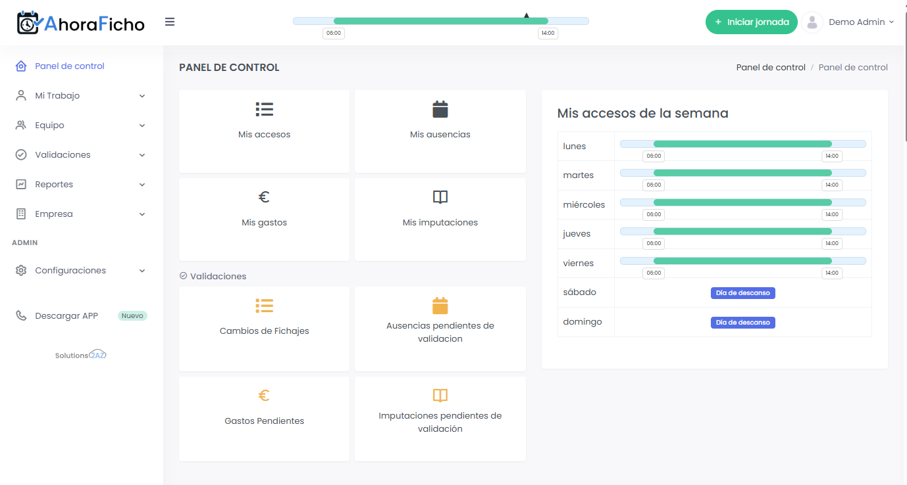

# Tu Primer Fichaje
{: .no_toc }

Guía paso a paso para realizar tu primer registro de entrada y salida en AhoraFicho.
{: .fs-6 .fw-300 }

---

## Contenido
{: .no_toc .text-delta }

1. TOC
{:toc}

---

## ¿Qué es un fichaje?

Un **fichaje** es el registro de tu entrada o salida del trabajo. AhoraFicho registra automáticamente:

- ⏰ **Hora exacta** del fichaje
- 📍 **Ubicación** (si está habilitada la geolocalización)
- 📱 **Dispositivo** desde el que se realiza
- 🌐 **IP** de conexión

{: .important }
> El fichaje es **obligatorio** según el Real Decreto-ley 8/2019 para todas las empresas en España.

---

## Tipos de fichaje

En AhoraFicho existen **4 tipos** de registros:

| Tipo | Icono | Descripción | Cuándo usarlo |
|:-----|:------|:------------|:--------------|
| **Entrada** | 🟢 | Inicio de jornada | Al llegar al trabajo |
| **Salida a pausa** | 🟡 | Inicio de descanso | Comida, café, etc. |
| **Regreso de pausa** | 🟡 | Fin de descanso | Al volver del descanso |
| **Salida** | 🔴 | Fin de jornada | Al terminar tu día laboral |

{: .note }
> El sistema detecta automáticamente qué tipo de fichaje corresponde según tu estado actual.

---

## Métodos de fichaje disponibles

AhoraFicho ofrece **4 métodos** diferentes para fichar. Tu empresa decide cuáles están habilitados para ti:

### 1. 🌐 Fichaje Web
Desde cualquier navegador accediendo a AhoraFicho.es

### 2. 📱 Fichaje App Móvil
Desde la aplicación de iOS o Android

### 3. 🔢 Fichaje por PIN
En terminales físicos usando tu código PIN de 6 dígitos

### 4. 🏷️ Fichaje por RFID
Con tarjeta RFID en terminales compatibles

<!-- ### 5. 📷 Fichaje por QR
Escaneando un código QR rotativo desde la app móvil -->

{: .tip }
> Consulta con tu administrador qué métodos están habilitados para tu cuenta.

---

## Cómo fichar desde la Web

Esta es la forma más rápida y común:

1. **Inicia sesión** en AhoraFicho.es
2. En el Dashboard verás un **botón grande de fichaje** arriba a la derecha
3. El botón muestra tu **estado actual**:
   - *"Iniciar jornada"* para entrar
   - *"Iniciar pausa"* si estás trabajando
   - *"Terminar pausa"* si estás en descanso
   - *"Finalizar jornada"* para salir
   - *"Fichar"* restro de registros

4. **Haz clic en el botón**
5. Si la geolocalización está habilitada, el navegador te pedirá **permiso para acceder a tu ubicación**
6. Haz clic en **"Permitir"**
7. ¡Listo! Verás una **confirmación** del fichaje

*Botón de fichaje visible en el Dashboard*

---

## Cómo fichar desde la App Móvil

### Paso 1: Abre la aplicación

1. Abre la app de AhoraFicho en tu móvil
2. Si es tu primera vez, [accede con tus credenciales o escanea el QR](/primeros-pasos/descarga-app-movil/)

### Paso 2: Ficha con un toque

1. En la pantalla principal verás el **botón de fichaje** prominente
2. El texto del botón cambia según tu estado actual
3. **Toca el botón**
4. La app solicitará acceso a tu ubicación (si está configurado)
5. Permite el acceso
6. ¡Fichaje registrado! Verás una confirmación visual

{: .note }
> La app móvil es ideal para trabajadores en campo o con movilidad, ya que registra la ubicación GPS exacta.

---

## Cómo fichar por PIN (Terminal)

Si tu empresa tiene terminales de fichaje con PIN:

### Configuración previa

1. Tu administrador te habrá asignado un **PIN de 6 dígitos**
2. Puedes consultar tu PIN en:
   - **Mi Perfil** → **PIN de terminal**
   - O preguntando a tu administrador

### Proceso de fichaje

1. Acércate al **terminal de fichaje**
2. La pantalla mostrará: *"Introduce tu PIN"*
3. Teclea tu **PIN de 6 dígitos**
4. Pulsa **Enter** o **#**
5. El terminal mostrará:
   - Tu nombre
   - Tipo de fichaje registrado
   - Hora exacta
6. ¡Listo!

{: .warning }
> **Importante**: No compartas tu PIN con nadie. Es tu identificador personal.

---

<!-- ## Cómo fichar por QR

### Desde la app móvil

1. Ve a tu perfil en la **web** de AhoraFicho
2. Genera tu **código QR personal**
3. En la app móvil, pulsa **"Fichar con QR"**
4. Escanea tu código QR
5. ¡Fichaje completado!

### QR general de la empresa

Algunas empresas tienen **QR generales** en lugares específicos:

1. Abre la app de AhoraFicho
2. Pulsa **"Escanear QR"**
3. Escanea el código QR de la empresa
4. Introduce tu PIN o credenciales si se solicitan
5. Confirma el fichaje

--- -->

## Cómo fichar por RFID

Si tu empresa usa tarjetas RFID:

1. Tu administrador te habrá asignado una **tarjeta RFID**
2. Acércate al **lector RFID**
3. **Aproxima tu tarjeta** al lector
4. Escucharás un *beep* de confirmación
5. El terminal mostrará tu fichaje

{: .note }
> Las tarjetas RFID son útiles en entornos donde no es práctico usar móviles o PINs.

---

## Geolocalización en el fichaje

### ¿Por qué se solicita ubicación?

La geolocalización permite:
- ✅ Verificar que fichas desde ubicaciones autorizadas
- ✅ Llevar control de trabajadores en campo
- ✅ Cumplir con requisitos de auditoría

### ¿Es obligatoria?

Depende de la configuración de tu empresa:
- **Obligatoria**: No podrás fichar sin compartir ubicación
- **Opcional**: Puedes fichar sin ubicación (se registrará como "sin ubicación")

{: .tip }
> Si trabajas desde ubicaciones variables, consulta con tu administrador sobre la configuración de geolocalización.

### Configurar permisos de ubicación

#### En navegadores web

**Google Chrome:**
1. Haz clic en el candado 🔒 junto a la URL
2. Busca "Ubicación"
3. Selecciona "Permitir"

**Firefox:**
1. Haz clic en el icono (i) junto a la URL
2. Busca "Permisos"
3. Activa "Ubicación"

#### En aplicaciones móviles

**Android:**
1. Ve a Ajustes → Aplicaciones
2. Busca "AhoraFicho"
3. Permisos → Ubicación → "Permitir siempre" o "Solo mientras se usa la app"

**iOS:**
1. Ve a Ajustes → Privacidad → Localización
2. Busca "AhoraFicho"
3. Selecciona "Siempre" o "Al usar la app"

---

## Visualizar tus fichajes

### En el Dashboard

El Dashboard muestra:
- ✅ Tu **estado actual** (fichado / no fichado)
- ⏰ **Hora de tus últimos fichajes de la semana**
- 📊 **Accesos directos**

### En "Mis Fichajes"

Ve a **"Mi Trabajo"** → **"Mis Fichajes"** para ver:

- Listado completo de fichajes por día
- Filtros por fecha
- Detalles de cada fichaje:
  - Hora exacta
  - Tipo (entrada/salida/pausa)
  - Ubicación (si aplica)
  - Dispositivo usado

### En "Mi Resumen Diario"

Ve a **"Mi Trabajo"** → **"Mi resumen diario"** para ver:

- Resumen consolidado por día
- Total de horas trabajadas
- Horas efectivas (descontando pausas)

---

## Problemas comunes

### No aparece el botón de fichaje

**Posibles causas:**
- Tu cuenta no tiene permisos de fichaje habilitados
- No es hora de fichar en base a tu horario

**Solución:** Contacta con tu administrador

### "No se pudo obtener la ubicación"

**Posibles causas:**
- Permisos de ubicación no concedidos
- GPS desactivado en el dispositivo
- Conexión a internet inestable

**Soluciones:**
1. Verifica que el GPS está activado
2. Concede permisos de ubicación a la app/navegador
3. Verifica tu conexión a internet

### "Ya has registrado un fichaje hace X segundos"

AhoraFicho previene fichajes duplicados. Debes esperar **al menos 1 minuto** entre fichajes.

{: .note }
> Esta protección evita fichajes accidentales duplicados.

### "IP no permitida"

Tu empresa puede tener restricciones de IP. Esto significa que solo puedes fichar desde:
- La red de la oficina
- IPs autorizadas por tu administrador

**Solución:** Contacta con tu administrador para autorizar tu IP actual.

---

## Consejos y buenas prácticas

### ✅ Ficha puntualmente
- Registra tu entrada al llegar
- Registra tus pausas y regresos
- Registra tu salida al terminar

### ✅ Verifica tus fichajes
Revisa diariamente que tus fichajes se han registrado correctamente en "Mis Fichajes"

### ✅ Comunica incidencias
Si olvidaste fichar, solicita un cambio de fichaje lo antes posible (ver [¿Olvidé fichar?](/guias-por-rol/empleado/olvide-fichar/))

### ✅ Mantén actualizada tu app
Si usas la app móvil, mantenla actualizada para evitar problemas

---

## ¿Olvidé fichar?

Si te das cuenta de que olvidaste fichar, no te preocupes. Consulta nuestra guía específica:

👉 [¿Qué hago si olvidé fichar?](/guias-por-rol/empleado/olvide-fichar/)

---

## Próximos pasos

Ahora que ya sabes cómo fichar:

1. 👉 [Descarga la app móvil](/primeros-pasos/descarga-app-movil/)
2. 👉 [Consulta tus fichajes](/guias-por-rol/empleado/consultar-mis-fichajes/)
3. 👉 [Aprende a solicitar vacaciones](/guias-por-rol/empleado/solicitar-vacaciones/)

---

## ¿Necesitas ayuda?

Si tienes problemas al fichar:

- 📧 Email: soporte@ahoraficho.es
- 💬 Consulta las [Preguntas Frecuentes](/preguntas-frecuentes/)
- 👨‍💼 Contacta con tu administrador o manager
