# Registro y Onboarding
{: .no_toc }

Proceso de alta de tu empresa en AhoraFicho y configuración inicial.
{: .fs-6 .fw-300 }

---

## Contenido
{: .no_toc .text-delta }

1. TOC
{:toc}

---

## ¿Cómo se registra una empresa?

El proceso de registro en AhoraFicho es sencillo y lo gestionamos nosotros para garantizar que todo esté correctamente configurado desde el inicio.

### Paso 1: Contratación del servicio

Puedes contratar AhoraFicho a través de:

- 🌐 **Web**: [www.ahoraficho.es](https://www.ahoraficho.es)
- 📧 **Email**: Contactando con comercial@ahoraficho.es
- 📞 **Teléfono**: +34 91 989 59 90

### Paso 2: Envío de información

Una vez contratado el servicio, te solicitaremos la siguiente información:

#### Datos de facturación
- Razón social de la empresa
- CIF/NIF
- Dirección fiscal
- Datos de contacto (email y teléfono)

#### Datos del administrador principal
- Nombre completo
- Email corporativo
- Rol en la empresa
- Teléfono de contacto

#### Estructura organizativa inicial
- **Horarios de trabajo**: Horarios típicos de la empresa
- **Departamentos**: Listado de departamentos (opcional)
- **Edificios/Centros de trabajo**: Si tienes múltiples ubicaciones

{: .important }
> Cuanta más información nos proporciones en esta fase, más personalizada estará tu configuración inicial.

---

## Configuración inicial realizada por AhoraFicho

Nuestro equipo se encarga de configurar los siguientes elementos:

### ✅ Configuración de la empresa

- Creación de tu tenant (espacio aislado)
- Configuración de logo corporativo (si se proporciona)
- Establecimiento de zona horaria
- Configuración de datos fiscales

### ✅ Estructura organizativa

- Creación de departamentos
- Alta de edificios/centros de trabajo
- Vinculación de departamentos con edificios

### ✅ Horarios base

- Configuración de horarios estándar
- Configuración de días festivos nacionales (opcional)
- Margen de flexibilidad horaria (si aplica)

### ✅ Trabajadores

- Alta de los trabajadores y del administrador principal
- Asignación de permisos / horarios y departamentos correspondientes
- Envío de credenciales de acceso al administrador

### ✅ Módulos activados

Por defecto, se activan:
- ✅ **Fichajes** (obligatorio)
- ✅ **Vacaciones y Ausencias** (obligatorio)

Módulos opcionales (bajo petición):
- 📦 Gastos
- 📦 Imputaciones de proyectos
- 📦 Turnos rotativos
- 📦 Servicios
- 📦 Documentos

{: .tip }
> **Consejo**: Puedes solicitar la activación de módulos adicionales en cualquier momento contactando con soporte.

---

## Timeline del proceso

El proceso completo suele tomar entre **24-48 horas laborables**:

```mermaid
gantt
    title Timeline de Configuración
    dateFormat  HH:mm
    section Día 1
    Contratación y envío de datos      :a1, 00:00, 2h
    Configuración inicial              :a2, after a1, 4h
    section Día 2
    Configuración avanzada             :a3, 00:00, 2h
    Alta de usuarios                   :a4, after a3, 2h
    Envío de credenciales              :a5, after a4, 2h
```

1. **Día 1 - Mañana**: Recibimos tu información
2. **Día 1 - Tarde**: Configuración inicial de la plataforma
3. **Día 2 - Mañana**: Alta de usuarios y configuración final
4. **Día 2 - Tarde**: Envío de credenciales y acceso a la plataforma

---

## Email de bienvenida

Una vez completada la configuración, recibirás un email con:

- 🔐 **Credenciales de acceso** (usuario y contraseña temporal)
- 🔗 **URL de acceso** a tu plataforma
- 📱 **Enlaces de descarga** de las apps móviles
- 📧 **Contacto de soporte** para cualquier duda

{: .warning }
> **Importante**: Cambia tu contraseña temporal en el primer acceso para garantizar la seguridad de tu cuenta.

---

## ¿Qué puedes modificar después?

Aunque nosotros configuramos la plataforma inicialmente, como administrador puedes modificar posteriormente:

- ✏️ Estructura de departamentos
- ✏️ Edificios y centros de trabajo
- ✏️ Horarios de trabajo
- ✏️ Días festivos
- ✏️ Tipos de ausencias
- ✏️ Notificaciones
- ✏️ Métodos de fichaje permitidos

Consulta la [Guía del Administrador](/guias-por-rol/administrador/) para conocer todas las opciones de configuración.

---

## Formación inicial

{: .note }
> Si lo necesitas, podemos ofrecerte una **sesión de formación online** para tu equipo de administración. Contacta con soporte para programarla.

---

## Próximos pasos

Una vez recibidas tus credenciales:

1. 👉 [Acceder a la plataforma](/primeros-pasos/acceso-a-la-plataforma/)
2. 👉 [Dar de alta a tus empleados](/guias-por-rol/administrador/dar-alta-empleados/)
3. 👉 [Configurar horarios y turnos](/guias-por-rol/administrador/crear-horarios/)

---

## ¿Necesitas ayuda?

Si tienes dudas durante el proceso de onboarding:

- 📧 Email: soporte@ahoraficho.es
- 💬 Responde al email de bienvenida
- 📞 Contacta con tu comercial asignado
